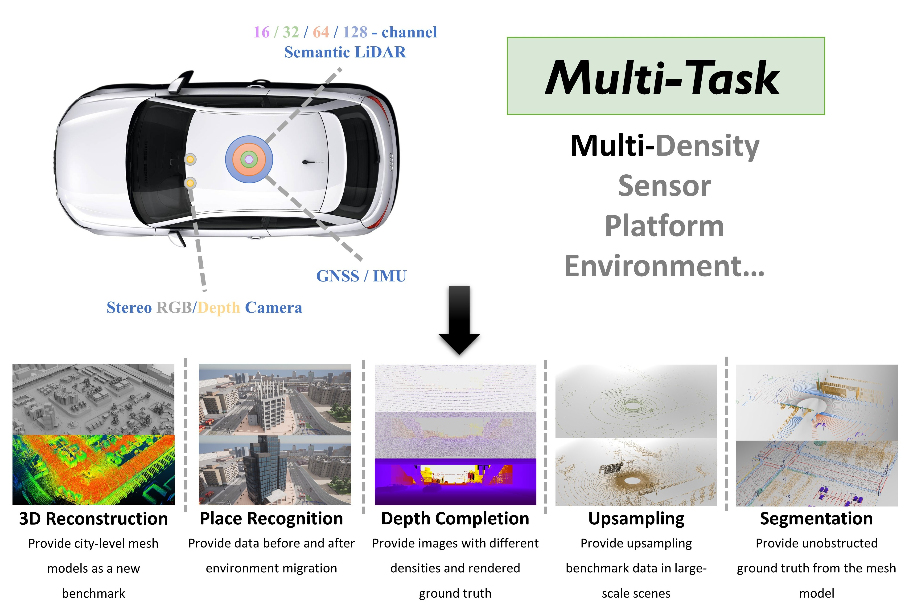
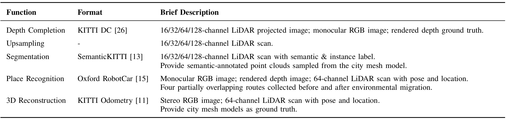
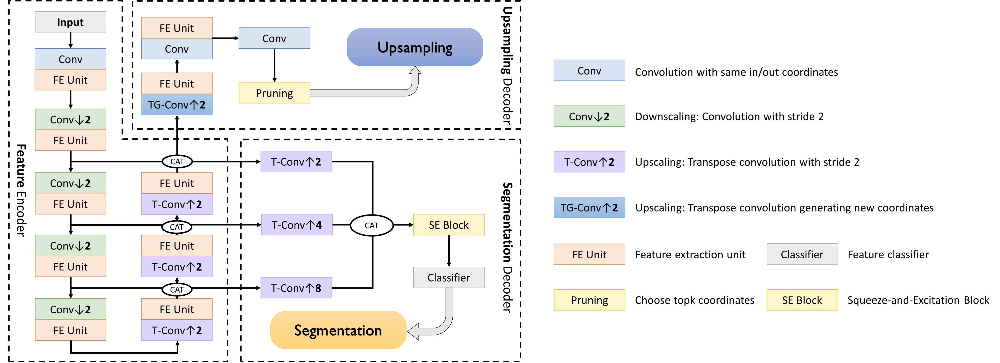
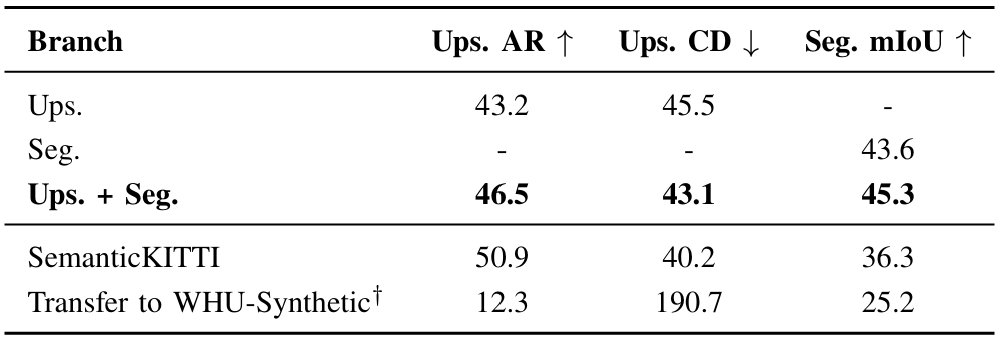
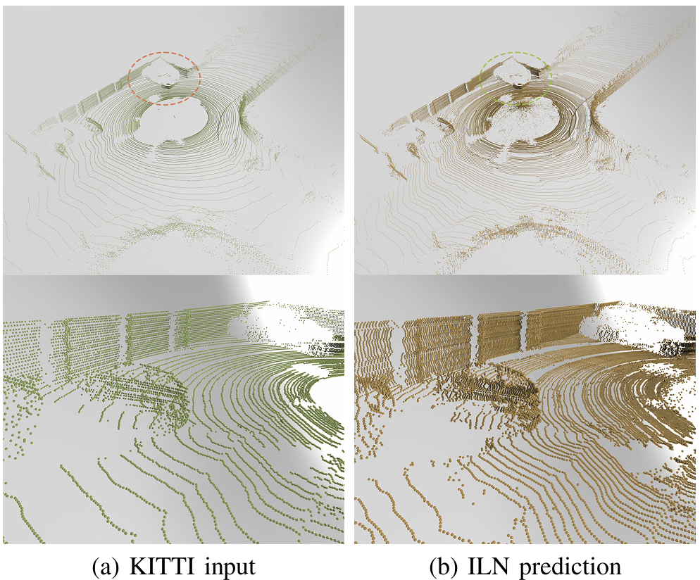

<h1 align="center"> <p> WHU-Synthetic </p></h1>
<h3 align="center">
<a href="https://github.com/WHU-USI3DV/WHU-Synthetic" target="_blank">WHU-Synthetic: A Synthetic Perception Dataset for 3D Multi-task Model Research</a>
</h3>
<p align="justify">
We introduce WHU-Synthetic, a large-scale 3D synthetic perception dataset designed for multi-task learning, from the initial data augmentation, through scene understanding, to macro-level tasks. Collected in the same environmental domain, we ensure inherent alignment across sub-tasks to construct multi-task models without separate training methods. Besides, we implement several novel settings, making it possible to realize certain ideas that are difficult to achieve in real-world scenarios. This supports more adaptive and robust multi-task perception tasks, such as sampling on city-level models, providing point clouds with different densities, and simulating temporal changes.
</p>



## 🆕 News
* The subset of our dataset is released! 🤩

* 2025-02-08:  Accepted by TGRS! 🎉🎉🎉

## 🚧 Download
<p align="justify">
You can download the subset of WHU-Synthetic dataset from <a href="https://pan.baidu.com/s/17a4DbyJhPooVz595DNulsg?pwd=et7g" target="_blank">BaiduDisk</a>. It has 40,000 frames and is collected in 8 different city maps.
</p>


<p align="justify">
The complete data of WHU-Synthetic is too large and can be obtained by request.
</p>

## 🔢 Dataset

### 1. Overview
<p align="justify">
WHU-Synthetic dataset is a large-scale synthetic 3D perception dataset designed for multi-task learning in 3D vision. It integrates multiple sub-tasks, including depth completion, point cloud upsampling, semantic segmentation, place recognition, and 3D reconstruction, all within the same environmental domain. Generated using the CARLA simulator, the dataset features over 140,000 fully annotated frames across diverse urban and rural scenes, with data collected from various sensors such as LiDAR, RGB cameras, and depth cameras. It also includes unique settings like multi-density point clouds, city-level surface sampling, and simulated environmental changes, which support advanced research in domain adaptation, robust perception, and the exploration of inter-task relationships.
</p>

### 2. Collection Settings and Format
<p align="justify">
In the WHU-Synthetic dataset, a single frame contains data that can be used to train multiple tasks simultaneously. To make it easier to work with, we outline the specific data items that may be relevant to individual sub-tasks in the table. However, it's important to emphasize that all of this data is captured at the same moment, which is key to our multi-task design. Additionally, for the sub-tasks of 3D reconstruction and place recognition, which require fixed routes, we have designed a series of specific routes and collected data separately.
</p>



<p align="justify">
We meticulously configure our setup by the parameters of KITTI sensors and added noise and post-effects to ensure the realism of the data, aiming to minimize domain shift. We successfully stack LiDARs with different channel counts at the same location to simulate point clouds of different densities at the sensor level, and the data are automatically annotated. The point clouds generated by LiDAR sensors share the same coordinate system and do not produce mutual occlusions.
</p>

<div align="center">

</div>


### 3. Unique Features
* **Multiple Density Data**: WHU-Synthetic captures point clouds with varying densities (16/32/64/128 channels) in a single frame, supporting tasks like upsampling, depth completion, and segmentation, and enabling domain adaptation studies.
* **City-Level Surface Sampling**: The dataset uses Monte Carlo Sampling to generate unobstructed point clouds from a city mesh model, divided into 120m × 120m blocks. This supports scene-level completion and city-scale 3D reconstruction.
* **Simulated Environmental Changes**: WHU-Synthetic simulates short-term changes in environments to study place recognition under dynamic conditions, providing insights into algorithm adaptability.

### 4. Multi-task Network
<p align="justify">
In the multi-task exploration experiment, we designed a framework with a shared backbone network to jointly perform point cloud upsampling and semantic segmentation tasks. The results showed that simultaneous training of both tasks improved performance: the average recall (AR) for upsampling increased from 43.2% to 46.5%, and the mean Intersection over Union (mIoU) for segmentation improved from 43.6% to 45.3%. This demonstrates a mutually reinforcing effect between the tasks, where upsampling provides geometric constraints for segmentation, and segmentation offers category-related information for upsampling. The experiment also highlighted the dataset's ability to support 3D multi-task training and its potential for real-world applications.
</p>



<div align="center">

</div>

### 5. Domain Shift
<p align="justify">
In the domain shift experiments, pre-trained models from the WHU-Synthetic dataset were tested on real-world datasets across three tasks: depth completion, point cloud upsampling, and semantic segmentation. For depth completion, the E-Net model trained on WHU-Synthetic indicates a moderate domain shift but reasonable generalization. In upsampling, ILN trained on WHU-Synthetic enhanced KITTI data with some noise, showing small domain shift. For semantic segmentation, the Minkowski U-Net achieved a mean IoU of 33.8% on SemanticKITTI, with significant variations across classes.
</p>

<div align="center">

</div>
### 6. Data Structure

```
WHU-Synthetic
├── rgb
│    ├── image_01
│    │    ├── 000001.png
|    |    ├── 000002.png
│    │    └── ...
│    ├── image_02
│    │    └── ...
│    └──
├── proj_depth
│    ├── ground_truth
│    │    ├── 000001.png
|    |    ├── 000002.png
│    │    └── ...
│    ├── velodyne_raw16
│    │    └── ...
│    ├── velodyne_raw32
│    │    └── ...
│    ├── velodyne_raw64
│    │    └── ...
│    ├── velodyne_raw128
│    │    └── ...
│    └──
└── pointcloud
     ├── 16
     │   ├── velodyne
     │   │    ├── 000001.bin
     │   |    ├── 000002.bin
     │   │    └── ...
     │   ├── labels
     │   │    ├── 000001.label
     │   |    ├── 000002.label
     │   │    └── ...
     │   ├── idx_labels
     │   │    ├── 000001.label
     │   |    ├── 000002.label
     │   │    └── ...
     │   └── ...
     ├── 32
     │    └── ...
     ├── 64
     │    └── ...
     ├── 128
     │    └── ...
     └──
```

* For the format of depth images, you can refer to [KITTI Depth](https://www.cvlibs.net/datasets/kitti/eval_depth.php?benchmark=depth_completion).
* For the format of annotated point clouds, you can refer to [SemanticKITTI](https://semantic-kitti.org/dataset.html#format).


## 📚 Citation

```
@article{zhou2025whu,
  title={WHU-Synthetic: A Synthetic Perception Dataset for 3D Multi-task Model Research},
  author={Zhou, Jiahao and Long, Chen and Xie, Yue and Wang, Jialiang and Zhang, Conglang and Li, Boheng and Wang, Haiping and Chen, Zhe and Dong, Zhen},
  journal={IEEE Transactions on Geoscience and Remote Sensing},
  year={2025},
  publisher={IEEE}
}
```

## 🎗️ Related Work

1. [CARLA Simulator](https://github.com/carla-simulator/carla)
2. [SHIFT: A Synthetic Driving Dataset for Continuous Multi-Task Domain Adaptation](https://github.com/SysCV/shift-dev)
3. [KITTI-CARLA: a KITTI-like dataset generated by CARLA Simulator](https://github.com/jedeschaud/kitti_carla_simulator)
4. [PU-Dense: Sparse Tensor-based Point Cloud Geometry Upsampling](https://github.com/aniqueakhtar/PointCloudUpsampling)
5. [PatchAugNet: Patch feature augmentation-based heterogeneous point cloud place recognition in large-scale street scenes](https://github.com/WHU-USI3DV/PatchAugNet)
